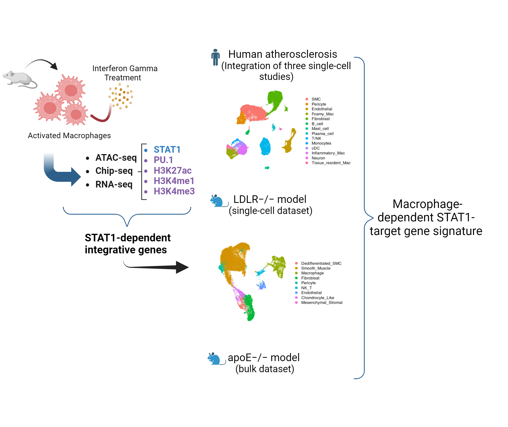

# Integrative Multi-Omics Analysis of IFNγ-induced Macrophages and Atherosclerotic Plaques

This repository contains the scripts and motifs used in the article [Integrative Multi-Omics Analysis of IFNγ-induced Macrophages and Atherosclerotic Plaques Reveals Macrophage-dependent STAT1-Driven Transcription in Atherosclerosis](https://www.biorxiv.org/content/10.1101/2024.09.06.611606v1)

---
### Repository Files

`Scripts:` This folder holds the scripts for analyzing and generating the figures used in the article.
 * `MQ_Meta_Analysis_Bulk_Figures_2_3.Rmd` The script for bulk data analysis used in figures 2&3
 * `1_*` The scripts for single-cell data analysis in a mouse model
 * `2_*` The scripts for single-cell data analysis in human samples

`PU1_GAS_ISRE_motifs.txt` PU1, GAS & ISRE motifs used for the analysis.

---
### Citation
> Eskandarian Boroujeni, M., Lopacinska, N., Antonczyk, A., Kluzek, K., Wesoly, J., & AR Bluyssen, H. (2024). Integrative Multi-Omics Analysis of IFNγ-induced Macrophages and Atherosclerotic Plaques Reveals Macrophage-dependent STAT1-Driven Transcription in Atherosclerosis. bioRxiv, 2024-09.
