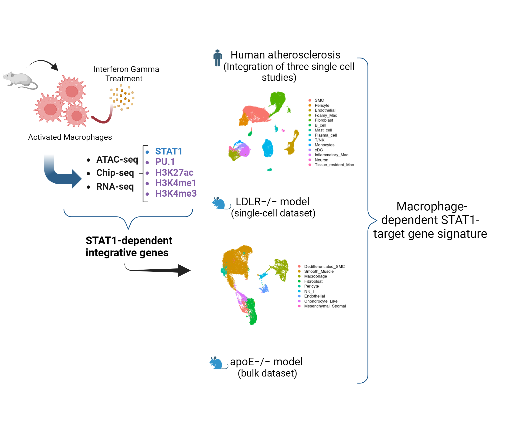

# Integrative Multi-Omics Analysis of IFNγ-induced Macrophages and Atherosclerotic Plaques

This repository contains the scripts and motifs used in the article [Integrative multi-omics analysis of IFNγ-induced macrophages and atherosclerotic plaques reveals macrophage-dependent STAT1-driven transcription in atherosclerosis](https://www.frontiersin.org/journals/immunology/articles/10.3389/fimmu.2025.1590953/full)

---
### Repository Files

`Scripts:` This folder holds the scripts for analyzing and generating the figures used in the article.
 * `DE_analysis_MQ.R` The script for bulk RNA-seq data analysis 
 * `MQ_Meta_Analysis_Bulk_Figures_2_3.Rmd` The script for bulk data analysis used in figures 2&3
 * `1_*` The scripts for single-cell data analysis in a mouse model
 * `2_*` The scripts for single-cell data analysis in human samples

`PU1_GAS_ISRE_motifs.txt` PU1, GAS & ISRE motifs used for the analysis.

---
### Citation
> Eskandarian Boroujeni, M., Lopacinska, N., Antonczyk, A., Kluzek, K., Wesoly, J. and Bluyssen, H.A., 2025. Integrative multi-omics analysis of IFNγ-induced macrophages and atherosclerotic plaques reveals macrophage-dependent STAT1-driven transcription in atherosclerosis. Frontiers in Immunology, 16, p.1590953.
